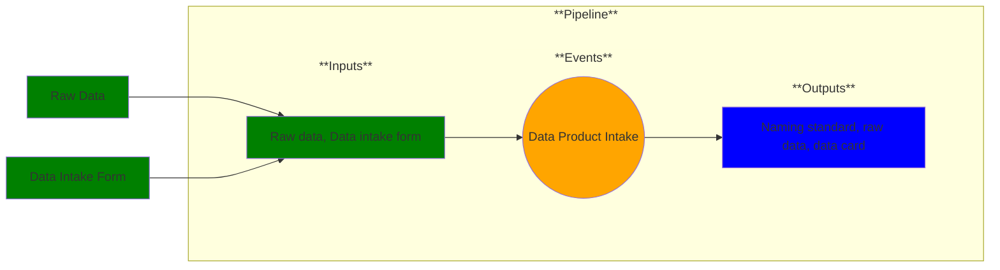

# Use Case 4: Data Product Intake

## Description

As a data scientist, I want my dataset in an understandable form so that I can perform analysis on it.

## Inputs

Raw Data, Data Intake Form

## Output

Curated, descriptive data (human-readable and understandable);
metadata description of curation transforms for the input data.

## Success path

1. Data card
2. TODO
    

\* = required steps

## Exceptions/Errors

1. TODO
