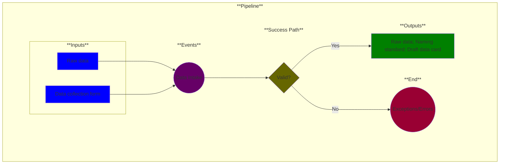

# Use Case 1: Data Intake

## Description

As a <a href='https://github.com/MLOps-OpenAPI/arch-diagrams?tab=readme-ov-file#data-scientists'>data scientist</a> or  <a href="https://github.com/MLOps-OpenAPI/arch-diagrams?tab=readme-ov-file#product-managers">product manager</a>, I want to upload raw data and associated background information into my data environment so that I can track its format, contents and lineage.

## Inputs

* Raw data
* Data collection form

## Output

* Raw data
* Naming standard
* Draft data card

## Success path

1. Data collection form contents validated
2. Draft data card created
3. Data collection form contents moved into data card
4. Raw data filename defined from data card contents + naming standard
5. Raw data with correct filename uploaded to data environment

## Exceptions/Errors

1. Data collection form incomplete
2. Data card could not be created
3. Data environment inaccessible
