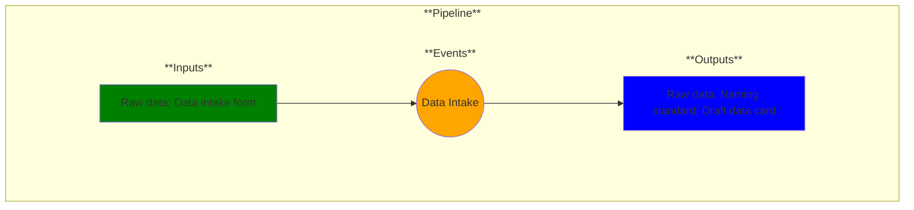

# Use Case 1: Data Intake

## Description

As a data manager, I want to upload raw data and associated background information into my data environment so that I can track its format, contents and lineage.

## Inputs

Raw data;
Data intake form

## Output

Raw data;
Naming standard;
Draft data card

## Success path

1. Data intake form contents validated
2. Draft data card created
3. Data intake form contents moved into data card
4. Raw data filename defined from data card contents + naming standard
5. Raw data with correct filename uploaded to data environment

## Exceptions/Errors

1. Data intake form incomplete
2. Data card could not be created
3. Data environment inaccessible
