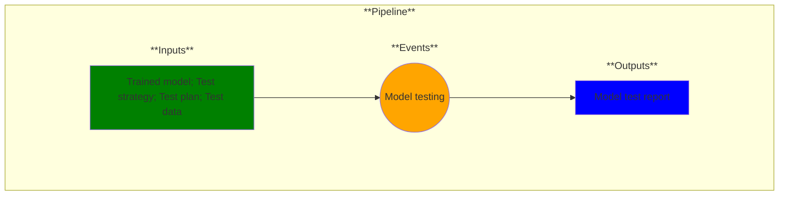

# Use Case 10: Model test and evaluation

## Description

As a test engineer, I want models evaluated so that I can have confidence in their results.

## Inputs

Trained model;
Test strategy;
Test plan;
Test data

## Output

Model test report

## Success path

1. Test report generated
2. Data/metadata added to secure database
    
## Exceptions/Errors

1. One or more test cases not executed
2. Test data missing
3. Data could not be added to database
4. Metadata not recorded
5. Database not accessible
6. Test report incomplete