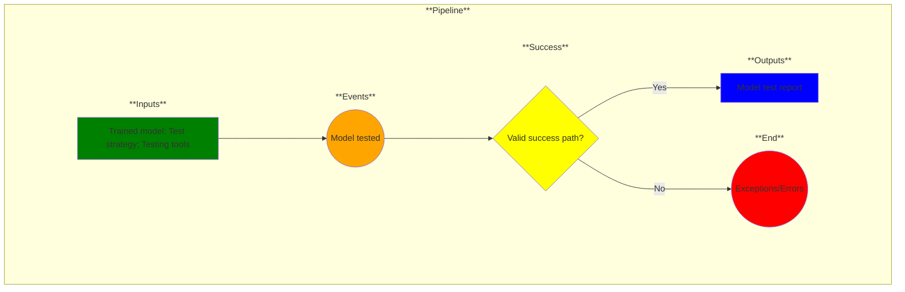

# Use Case 10: Model test

## Description

As a Data Scientist, I want models tested so that I can have confidence in their results.

## Inputs

Trained model;
Test strategy;
Testing tools

## Output

Test results

## Success path

1. Test report generated
2. Data/metadata added to secure database
    
## Exceptions/Errors

1. One or more test cases not executed
2. Test data missing
3. Data could not be added to database
4. Metadata not recorded
5. Database not accessible
6. Test report incomplete; test strategy not followed