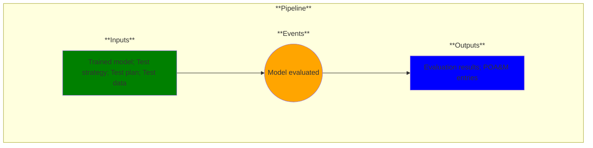

# Use Case 11: Model evaluation

## Description

As a test engineer, I want tests evaluated so that I can provide evidence that model results meet user requirements.

## Inputs

Evaluation strategy;
Test results

## Output

Evaluation results;
Plan of Actions and Milestones entries

## Success path

1. Evaluation results generated
2. Security/vulnerability results generated
    
## Exceptions/Errors

1. Evaluation incomplete
2. Container not accessible