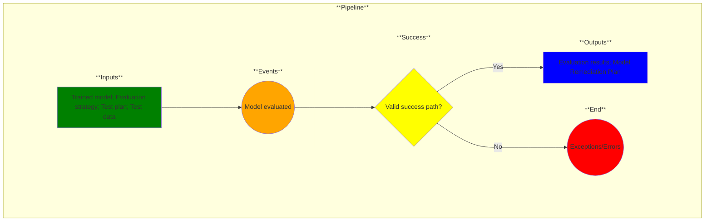

# Use Case 11: Model evaluation

## Description

As a Data Scientist, I want tests evaluated so that I can provide evidence that model results meet user requirements.

## Inputs

Trained model;
Evaluation strategy;
Test plan;
Test data

## Success

Evaluation results;
Model Remediation Plan

## Success path

1. Evaluation results generated
2. Model Remediation Plan generated
    
## Exceptions/Errors

1. Evaluation incomplete
2. Model Remediation Plan could not be determined