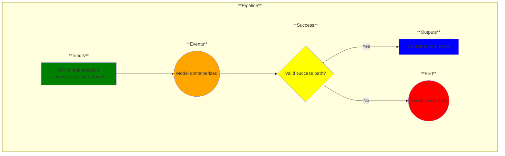

# Use Case 12: Model containerized

## Description

As a Data Scientist or ML Engineer, I want models packaged in a container so that I can ensure consistent and isolated execution across different computing environments.

## Inputs

OCI containerization standard;
Trained model

## Output

Containerized model

## Success path

1. Dependencies identified
2. Container(s) generated
3. Needed ports opened
4. Service configuration file generated
5. Software bill of materials generated
    
## Exceptions/Errors

1. Dependencies not identified
2. Containers not generated
3. Cannot open necessary ports