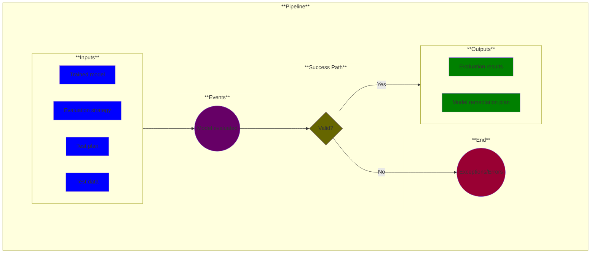

# Use Case 12: Model evaluation

## Description

As a <a href="https://github.com/MLOps-OpenAPI/arch-diagrams?tab=readme-ov-file#data-scientists">Data Scientist</a>, I want tests evaluated so that I can provide evidence that model results meet user requirements.

## Inputs

* Trained model
* Evaluation strategy
* Test plan
* Test data

## Success

* Evaluation results
* Model remediation plan

## Success path

1. Evaluation results generated
2. Model remediation plan generated
    
## Exceptions/Errors

1. Evaluation incomplete
2. Model remediation plan could not be determined