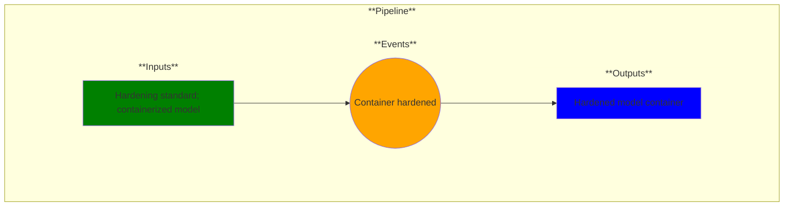

# Use Case 13: Hardened model containers

## Description

As a security engineer, I want model containers hardened so that I can reduce vulnerabilities to make the containers resilient against security threats.

## Inputs

Hardening standard;
Containerized model

## Output

Hardened model container

## Success path

1. Model container hardened
    
## Exceptions/Errors

1. Hardening incomplete
