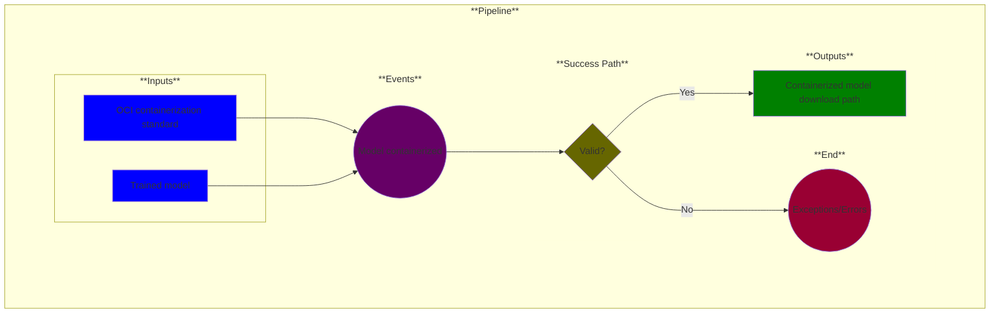

# Use Case 13: Model containerized (optional)

## Description

As a <a href="https://github.com/MLOps-OpenAPI/arch-diagrams?tab=readme-ov-file#data-scientists">Data Scientist</a> or <a href="https://github.com/MLOps-OpenAPI/arch-diagrams?tab=readme-ov-file#ml-engineers">ML Engineer</a>, I want models packaged in a container so that I can ensure consistent and isolated execution across different computing environments.

## Inputs

* OCI containerization standard
* Trained model

## Output

* Containerized model download path

## Success path

1. Dependencies identified
2. Container(s) generated
3. Needed ports opened
4. Service configuration file generated
5. Software bill of materials generated
    
## Exceptions/Errors

1. Dependencies not identified
2. Containers not generated
3. Cannot open necessary ports