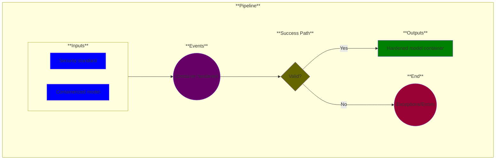

# Use Case 14: Container Security Scan (optional)

## Description

As a <a href="https://github.com/MLOps-OpenAPI/arch-diagrams?tab=readme-ov-file#security--compliance-officers">Security Officer</a> or <a href="https://github.com/MLOps-OpenAPI/arch-diagrams?tab=readme-ov-file#ml-engineers">ML Engineer</a>, I want model containers hardened so that I can reduce vulnerabilities to make the containers resilient against security threats.

## Inputs

* Security standard
* Containerized model

## Output

* Hardened model container

## Success path

1. Model container hardened
    
## Exceptions/Errors

1. Scan failed
