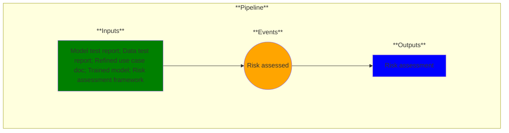

# Use Case 14: Risk profiled

## Description

As a security engineer, I want to profile data and model risks so that mitigation strategies and informed decisions can be made to lower risk.

## Inputs

Model test report;
Data test report;
Refined use case doc;
Trained model;
Risk assessment framework

## Output

Risk assessment

## Success path

1. Risk assessment tools executed
2. Risk assessment generated
    
## Exceptions/Errors

1. Input missing
2. Input format incompatible with risk assessment tools
