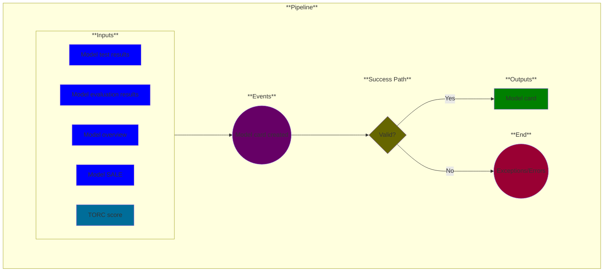

# Use Case 15: Model card created (optional)

## Description

* As a <a href="https://github.com/MLOps-OpenAPI/arch-diagrams?tab=readme-ov-file#ml-engineers">ML Engineer</a>, <a href="https://github.com/MLOps-OpenAPI/arch-diagrams?tab=readme-ov-file#data-scientists">Data Scientist</a>, or <a href='https://github.com/MLOps-OpenAPI/arch-diagrams?tab=readme-ov-file#ai-engineers--intelligent-app-developers'>AI Engineers/Intelligent App Developers</a>, I want to understand enough of the ML model methodology and evaluation so that I can trust its outputs.

## Inputs

* Model test results
* Model evaluation results
* Model overview (required)
* Model SALE (Summary of Assumptions, Limitations and Errors/Exceptions)
* TORC score (optional)

## Output

Model card

## Success path

1. Model test results parsed
2. Model evaluation results parsed
3. Model overview parsed
4. Model SALE parsed
5. TORC score read
6. Model card generated

## Exceptions/Errors

1. Model test results incomplete
2. Model evaluation results incomplete
3. Model overview incomplete
4. Model SALE incomplete
5. TORC score missing
