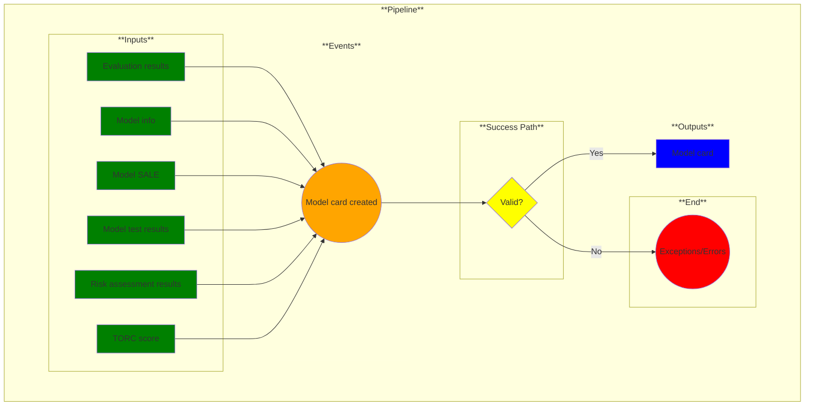

# Use Case 15: Model card created

## Description

* As a <a href="https://github.com/MLOps-OpenAPI/arch-diagrams?tab=readme-ov-file#ml-engineers">ML Engineer</a>, <a href="https://github.com/MLOps-OpenAPI/arch-diagrams?tab=readme-ov-file#data-scientists">Data Scientist</a>, or <a href='https://github.com/MLOps-OpenAPI/arch-diagrams?tab=readme-ov-file#ai-engineers--intelligent-app-developers'>AI Engineers/Intelligent App Developers</a>, I want to understand enough of the ML model methodology and evaluation so that I can trust its outputs.

## Inputs

* Evaluation results
* Model info (required)
* Model SALE (Summary of Assumptions, Limitations and Errors/Exceptions)
* Model test results
* Risk assessment results
* TORC score (optional)

## Output

Model card

## Success path

1. Evaluation results parsed
2. Model info parsed
3. Model SALE parsed
4. Model test results parsed
5. Risk assessment parsed
6. TORC score read
7. Model card generated

## Exceptions/Errors

1. Evaluation results incomplete
2. Model info incomplete
3. Model SALE incomplete
4. Model test results incomplete
5. Risk assessment incomplete
6. TORC score missing
