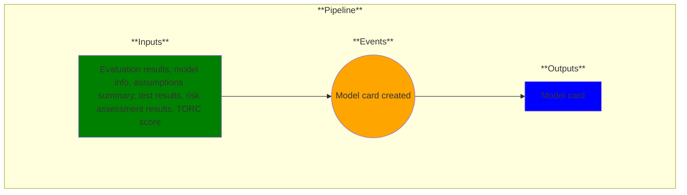

# Use Case 16: Model Card

## Description

As a Data Scientist and MLOps Engineer I want a model card that contains details about the model.

## Inputs

Evaluation results, model info, assumptions summary, test results, risk assessment results, TORC score

## Output

Model card

## Success path

1. A model card is created with the required information.

## Exceptions/Errors

1. The model is not created successfully.
2. Required information is not included on the model card.
