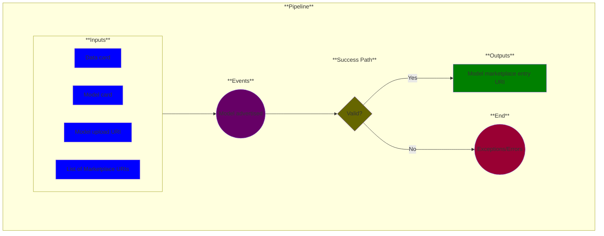

# Use Case 16: Model Marketplace

## Description

As a <a href="https://github.com/MLOps-OpenAPI/arch-diagrams?tab=readme-ov-file#data-scientists">Data Scientist</a>, <a href="https://github.com/MLOps-OpenAPI/arch-diagrams?tab=readme-ov-file#product-managers">Product Manager</a> or <a href="https://github.com/MLOps-OpenAPI/arch-diagrams?tab=readme-ov-file#ml-engineers">ML Engineer</a>, I want to publish models in a secure way so that other authorized users can download and use them.

## Inputs

* Data card
* Model card
* Model upload URI
* List of Marketplace URIs* 

\* = optional input; defaults pulled from Settings

## Output

Model marketplace entry URI

## Success path

1. The model is uploaded to the marketplace and is available for authorized users to download.

## Exceptions/Errors

1. The model is not uploaded successfully.
2. Unauthorized users **do not** have access to download the model.
3. Inability to upload the model.