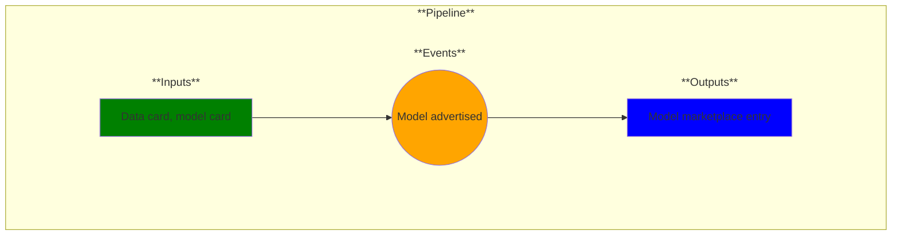

# Use Case 17: Model Marketplace

## Description

As a Data Scientist I want to publish my models in a secure way so that other authorized users can download and use them.

## Inputs

Data card, model card

## Output

Model marketplace entry

## Success path

1. The model is uploaded to the marketplace and is available for authorized users to download.

## Exceptions/Errors

1. The model is not uploaded successfully.
2. Unauthorized users have access to download the model.
