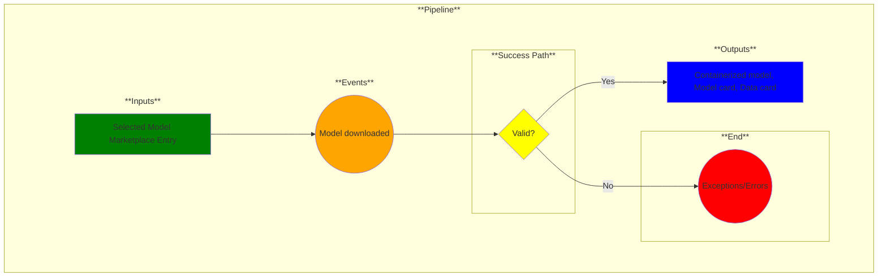

# Use Case 18: Model Downloads

## Description

* As an <a href='https://github.com/MLOps-OpenAPI/arch-diagrams?tab=readme-ov-file#ai-engineers--intelligent-app-developers'>AI Engineers/Intelligent App Developers</a> I want to integrate or test model inference endpoints with any application.
* As a <a href="https://github.com/MLOps-OpenAPI/arch-diagrams?tab=readme-ov-file#data-scientists">Data Scientist</a> I want to test my model inference endpoints and share the inference endpoint URL with my team.
* As an <a href="https://github.com/MLOps-OpenAPI/arch-diagrams?tab=readme-ov-file#mlops-engineers">MLOps Engineer</a> I want to unit test and performance test my model inference endpoints.
* As an <a href="https://github.com/MLOps-OpenAPI/arch-diagrams?tab=readme-ov-file#quality-assurance-qa-engineers">Quality Assurance (QA) Engineer</a> I want to test models for stability and performance.
* As an <a href="https://github.com/MLOps-OpenAPI/arch-diagrams?tab=readme-ov-file#security--compliance-officers">Security & Compliance Officers</a> I want to make sure the model adheres to security protocols.

* As an <a href="https://github.com/MLOps-OpenAPI/arch-diagrams?tab=readme-ov-file#ml-engineers">ML Engineer</a>, <a href="https://github.com/MLOps-OpenAPI/arch-diagrams?tab=readme-ov-file#data-scientists">Data Scientist</a>, <a href='https://github.com/MLOps-OpenAPI/arch-diagrams?tab=readme-ov-file#ai-engineers--intelligent-app-developers'>AI Engineers/Intelligent App Developers</a>, <a href='https://github.com/MLOps-OpenAPI/arch-diagrams?tab=readme-ov-file#3rd-party-tester'>3rd party tester</a>, or <a href='https://github.com/MLOps-OpenAPI/arch-diagrams?tab=readme-ov-file#security--compliance-officers'>Security & Compliance Officer</a> I want to download secure models with knowledge of the data the model was trained on as well as details of the model.

## Inputs

Selected Model Marketplace Entry

## Output

Containerized model, Model card, Data card

## Success path

1. A valid model, model card, and data card are downloaded.

## Exceptions/Errors

1. Model, model card, or data card not fully downloaded.
