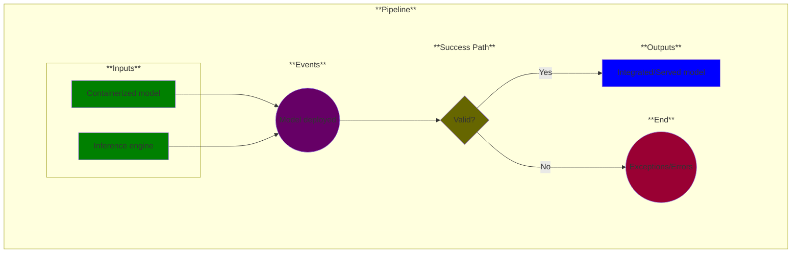

# Use Case 19: Model Deployment

## Description

As an <a href="https://github.com/MLOps-OpenAPI/arch-diagrams?tab=readme-ov-file#ml-engineers">ML Engineer</a>, I want to deploy multiple models in a scalable and safe way.

## Inputs

* Containerized model
* Inference engine

## Output

* Integrated/Served model

## Success path

1. A model is deployed

## Exceptions/Errors

1. Models not deployed
