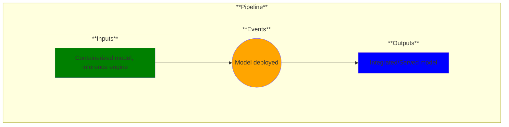

# Use Case 19: Model Deployment

## Description

As an MLOps Engineer I want to deploy multiple models in a scalable and safe way.

## Inputs

Containerized model, inference engine

## Output

Integrated/Served model

## Success path

1. A model is deployed

## Exceptions/Errors

1. Models not deployed
