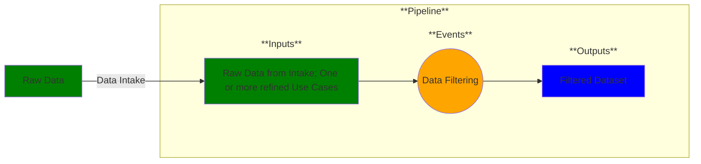

# Use Case 2: Data Filtering

## Description

As a data manager, I want my dataset filtered so that it only contains information relevant to my use case(s).

## Inputs

One or more refined use case documents;
Raw data from intake location

## Output

Filtered dataset

## Success path

1. Raw data filtered according to use case(s)
2. Data transformations recorded as metadata *

\* = required steps

## Exceptions/Errors

1. Metadata not recorded
2. Transformations could not be executed