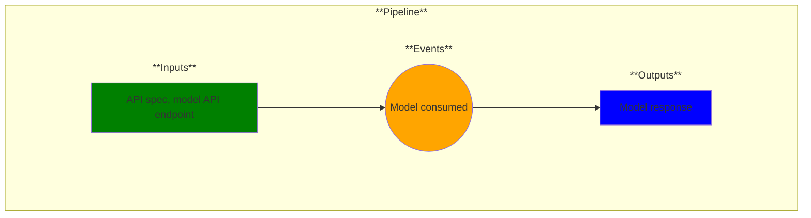

# Use Case 21: Model Consumed

## Description

* As an Application Developer I want to integrate or test model inference endpoints with amy application.
* As a Data Scientist I want to test my model inference endpoints and share the inference endpoint URL with my team.
* As an MLOps Engineer I want to unit test and performance test my model inference endpoints.

## Inputs

API spec, model API endpoint

## Output

Model response

## Success path

1. Models are accessible
2. Models return appropriate response

## Exceptions/Errors

1. Models not available
2. Models not returning correct response
