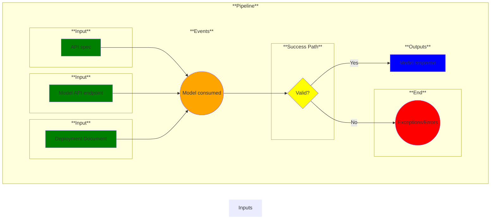

# Use Case 20: Model Consumed

## Description

* As an <a href='https://github.com/MLOps-OpenAPI/arch-diagrams?tab=readme-ov-file#ai-engineers--intelligent-app-developers'>AI Engineers/Intelligent App Developers</a> I want to integrate or test model inference endpoints with any application.
* As a <a href="https://github.com/MLOps-OpenAPI/arch-diagrams?tab=readme-ov-file#data-scientists">Data Scientist</a> I want to test my model inference endpoints and share the inference endpoint URL with my team.
* As an <a href="https://github.com/MLOps-OpenAPI/arch-diagrams?tab=readme-ov-file#mlops-engineers">MLOps Engineer</a> I want to unit test and performance test my model inference endpoints.
* As an <a href="https://github.com/MLOps-OpenAPI/arch-diagrams?tab=readme-ov-file#quality-assurance-qa-engineers">Quality Assurance (QA) Engineer</a> I want to test models for stability and performance.
* As an <a href="https://github.com/MLOps-OpenAPI/arch-diagrams?tab=readme-ov-file#security--compliance-officers">Security & Compliance Officers</a> I want to make sure the model adheres to security protocols.

## Inputs

* API spec
* Model API endpoint
* Deployment document

## Output

Model response

## Success path

1. Models are accessible
2. Models return appropriate response

## Exceptions/Errors

1. Models not available
2. Models not returning correct response
