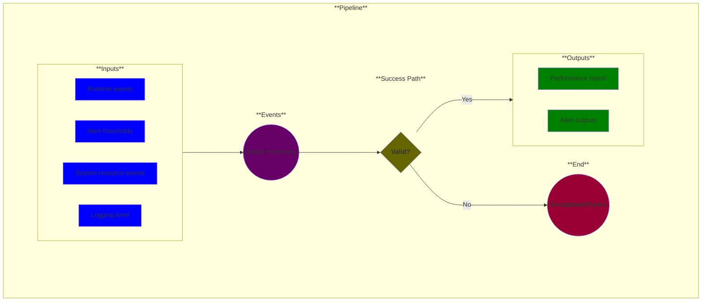

# Use Case 20: Model Monitoring (optional)

## Description

As an <a href="https://github.com/MLOps-OpenAPI/arch-diagrams?tab=readme-ov-file#ml-engineers">ML Engineer</a>, <a href="https://github.com/MLOps-OpenAPI/arch-diagrams?tab=readme-ov-file#data-scientists">Data Scientist</a>, <a href="https://github.com/MLOps-OpenAPI/arch-diagrams?tab=readme-ov-file#product-managers">Product Manager</a>, or a <a href="https://github.com/MLOps-OpenAPI/arch-diagrams?tab=readme-ov-file#3rd-party-tester">3rd party tester</a> I want to monitor AI models to ensure their accuracy, reliability, and value. Monitoring for Model drift, data quality, bias and fairness, security, and compliance should be considered for implementation when deploying models. 

Models may be continuously monitored, resources may be limited and pruning/filtering could be necessary.

## Inputs

* Alert thresholds
* Runtime events
    * User interactions: specific inference requests
    * Ongoing interactions: continuous inference requests
    * Non-inference interactions: other interactions that could be useful in debugging
* System resource events (optional)
* Logging level (optional)

## Output

* Performance report
* Alert outputs

## Success path

1. Models are monitored
2. Model metrics are logged at configured level(s)
3. Alerts are raised when thresholds are reached on metrics that are monitored

## Exceptions/Errors

1. Metrics not being collected/logged
2. Events not being raised from metrics that are monitored 
