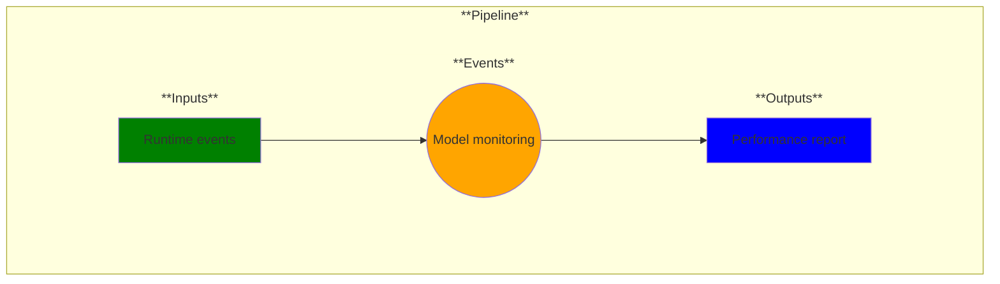

# Use Case 21: Model Monitoring

## Description

As an MLOps Engineer, I want to monitor the models I deploy.

## Inputs

Runtime events

## Output

Performance report

## Success path

1. Models are continuously monitored
2. Model metrics are logged at configured level(s)
3. Alerts are raised when thresholds are reached on metrics that are monitored

## Exceptions/Errors

1. Metrics not being collected/logged
2. Events not being raised from metrics that are monitored 
