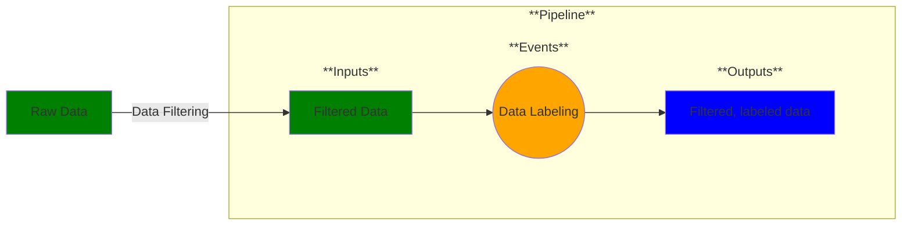

# Use Case 3: Data Labeling

## Description

As a data manager, I want my dataset labeled so that I can prepare it for machine learning.

## Inputs

Filtered data;
Object ontology

## Output

Filtered, labeled data

## Success path

1. Objects identified according to ontology
2. Data labeling performed

## Exceptions/Errors

None