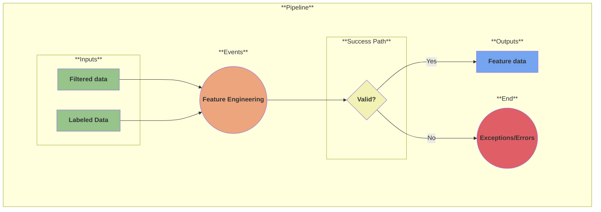

# Use Case 3a: Feature Engineering

## Description

As a <a href='https://github.com/MLOps-OpenAPI/arch-diagrams/blob/main/README.md#data-scientists'>data scientist</a> or <a href='https://github.com/MLOps-OpenAPI/arch-diagrams/blob/main/README.md#data-engineers'>data engineer</a> I want to extract, transform, and select the most relevant data from my datasets to produce high-quality ML models.

## Inputs

* Filtered data
* Labeled data

## Output

* Features data

## Success path

1. Features extracted
2. Features stored in feature store (optional)

## Exceptions/Errors

1. Feature store not available
2. Features not extracted