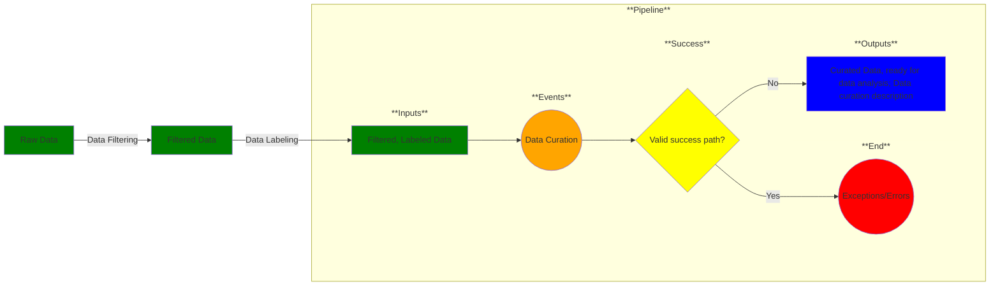

# Use Case 4: Data Analysis

## Description

As a  <a href='https://github.com/MLOps-OpenAPI/arch-diagrams/blob/main/README.md#data%20scientists'>data scientist</a> or <a href='https://github.com/MLOps-OpenAPI/arch-diagrams/blob/main/README.md#data%20engineers'>data engineer</a>, I want my dataset in an understandable form so that I can perform analysis on it.

## Inputs

Filtered, labeled data

## Output

Curated, descriptive data (human-readable and understandable);
metadata description of curation transforms for the input data.
TODO: Figure out how to represent required metadata.

## Success path

1. Data annotations/descriptions added
2. Curated data validated against schema/rules
3. Data transformations recorded as metadata *
4. Metadata added to secure database *
    

\* = required steps

## Exceptions/Errors

1. Curated data does not match schema 
2. Curated data violates validation rules
3. Curated data could not be added to database
4. Metadata not recorded
5. Database not accessible
