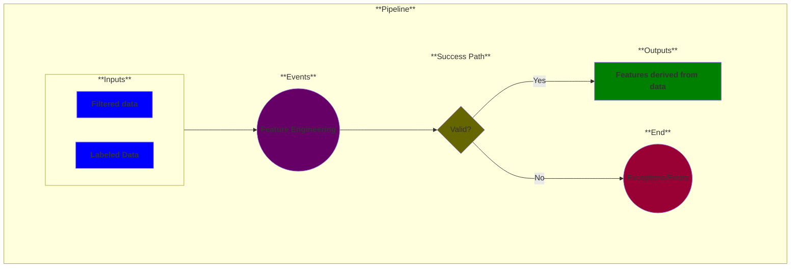

# Use Case 4: Feature Engineering (optional)

## Description

As a <a href='https://github.com/MLOps-OpenAPI/arch-diagrams?tab=readme-ov-file#data-scientists'>Data Scientist</a> or 
<a href='https://github.com/MLOps-OpenAPI/arch-diagrams?tab=readme-ov-file#data-engineers'>Data Engineer</a> 
I want to extract, select, and transform the most relevant data into features from my datasets to produce high-quality ML models. 

## Inputs

* Filtered data
* Labeled data

## Output

* Features derived from data

## Success path

1. Features derived from data
2. Features stored in feature store *

\* = optional steps

## Exceptions/Errors

1. Feature store not available
2. Features not extracted