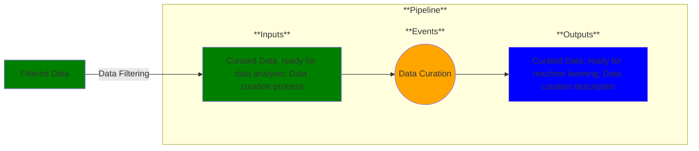

# Use Case 5: Data Analysis

## Description

As a ML engineer, I want my dataset prepared so that I can perform machine learning on it.

## Inputs

Curated data, ready for data analysis;
Data curation process

## Output

Curated data, ready for machine learning;
Data curation description

## Success path

1. Curated data validated against schema/rules
2. Data transformations recorded as metadata *
3. Data/metadata added to secure database *
    

\* = required steps

## Exceptions/Errors

1. Curated data does not match schema 
2. Curated data violates validation rules
3. Curated data could not be added to database
4. Metadata not recorded
5. Database not accessible
