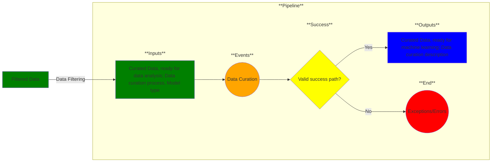

# Use Case 5: ML-ready data

## Description

As a <a href='https://github.com/MLOps-OpenAPI/arch-diagrams/blob/main/README.md#mlops-engineer'>ML engineer</a> and <a href='https://github.com/MLOps-OpenAPI/arch-diagrams/blob/main/README.md#data-scientists'>data scientist</a>, I want my dataset prepared so that I can perform machine learning on it.

## Inputs

Curated data, ready for data analysis;
Data curation process; Model type

## Output

Curated data, ready for machine learning;
Data curation description

## Success path

1. Curated data matches up against model inputs
2. Data transformations recorded as metadata *
3. Data/metadata added to secure database *
    

\* = required steps

## Exceptions/Errors

1. Curated data does not match schema 
2. Curated data violates validation rules
3. Curated data could not be added to database
4. Metadata not recorded
5. Database not accessible
