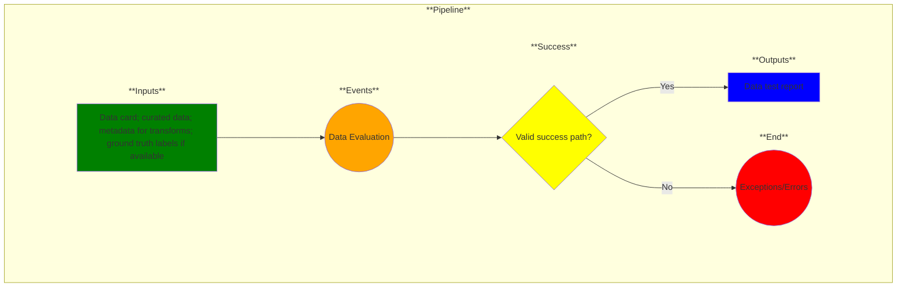

# Use Case 6: Data Evaluation

## Description

As a <a href='https://github.com/MLOps-OpenAPI/arch-diagrams/blob/main/README.md#data-engineer'>data engineer</a>, I want my curated datasets evaluated so that I can have confidence in the data.

## Inputs

* Data card*
* Curated data*
* Metadata for transforms*
* Ground truth labels

\* = required inputs

## Output

Data test report 

## Success path

1. Data distribution matches customer use case
2. Data provenance established
3. Label quality verified
4. Data trends follow expected results
5. Data trends are internally consistent
6. Adequate explanation when data trends do not follow
7. Metadata transforms match with data at each stage

## Exceptions/Errors

1. Data distribution does not match customer use case
2. Data provenance not established
3. Labels do not match ground truth
4. Unexplained data anomalies found