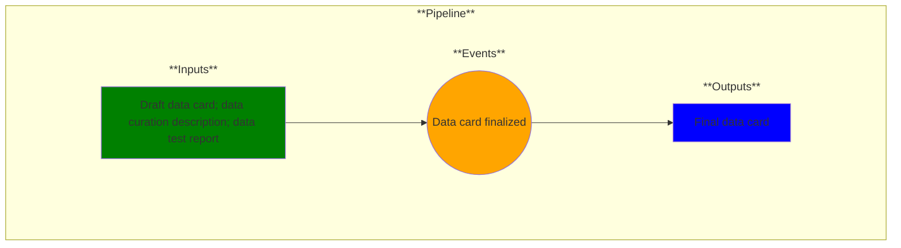

# Use Case 7: Data Card Finalized

## Description

As a data manager, I want my data card in a final form so that the dataset quality is communicated to customers.

## Inputs

Draft data card; data curation description; data test report

## Output

Final data card

## Success path

1. Data distribution matches customer use case
2. Data provenance established
3. Label quality verified
4. Data trends follow expected results
5. Data trends are internally consistent
6. Adequate explanation when data trends do not follow
7. Metadata transforms match with data at each stage

## Exceptions/Errors

1. Data distribution does not match customer use case
2. Data provenance not established
3. Labels do not match ground truth
4. Unexplained data anomalies found
