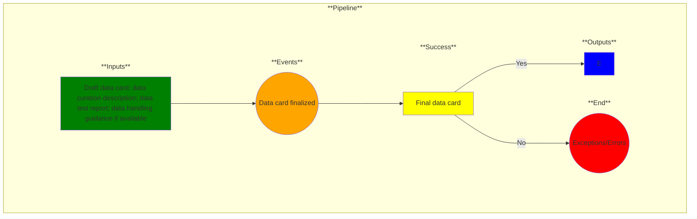

# Use Case 7: Data Card Finalized

## Description

As a Product Manager, I want my [data card](https://sites.research.google/datacardsplaybook/) in a final form so that the dataset quality is communicated to customers.

## Inputs

Draft data card; data curation description; data evaluation report; data handling guidance*

\* = optional input

## Output

Final data card

## Success path

1. All data card entries filled 

## Exceptions/Errors

1. One or more data card entries are unfilled
