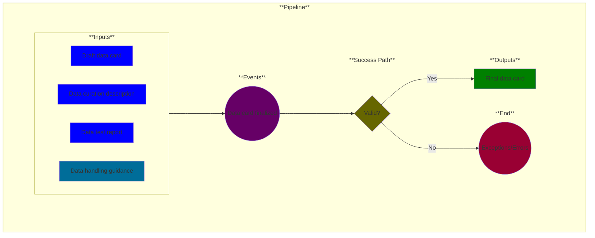

# Use Case 9: Data Card Finalized

## Description

As a <a href="https://github.com/MLOps-OpenAPI/arch-diagrams?tab=readme-ov-file#product-managers">Product Manager</a>, I want my [data card](https://sites.research.google/datacardsplaybook/) in a final form so that the dataset quality is communicated to customers.

## Inputs

* Draft data card
* Data curation description
* Data evaluation report
* Data handling guidance*

\* = optional input

## Output

* Final data card

## Success path

1. All data card entries filled 

## Exceptions/Errors

1. One or more data card entries are unfilled
