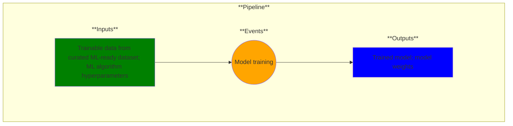

# Use Case 9: Model trained

## Description

As a ML engineer, I want my model trained so that I can make predictions on new unseen data.

## Inputs

Trainable data from curated ML-ready dataset; ML algorithm hyperparameters

## Output

Trained model; Model weights

## Success path

1. ML algorithm hyperparameters recorded as metadata
2. ML training details recorded as metadata
3. Trained model as artifact
4. Model weights as artifact

## Exceptions/Errors

1. Metadata not recorded
2. Training data not model-compatible
3. Artifacts not stored