# Use Case 1: Data Intake

## Description

As a data manager, I want to upload raw data and associated background information into my data environment so that I can track its format, contents and lineage.

## Inputs

Raw data;
Data intake form

## Output

Raw data;
Naming standard;
Data card

```mermaid

%% Creating a left-to-right flowchart
%% Learn the syntax here: https://mermaid.js.org/syntax/flowchart.html
%% Note: flowchart and graph are the same in Mermaid
flowchart LR

    %% Define the common flow items:
    subgraph Pipeline ["**MLOps Pipeline**"]
        direction TB
        %% Add an empty node to overcome some formatting issues
        subgraph dataPipeline["***Data Pipeline***"]
            direction LR
            %% Add the rest of the nodes
            subgraph Data Intake [<br/>]
                A[Data Intake]
                style A fill:green 
            end
            subgraph Data Filtering [<br/>]
                B[Data Filtering]
                style B fill:green
            end
            subgraph Data Labeling [<br/>]
                C[Data Labeling]
                style C fill:green
            end
            subgraph Data Analysis [<br/>]
                D[Data Analysis]
                style D fill:green
            end
            subgraph Data ML Ready [<br/>]
                E[Data ML Ready]
                style E fill:green
            end
            subgraph Data Test/Eval [<br/>]
                F[Data Test/Eval]
                style F fill:green
            end
            subgraph dataCardFinal [<br/>]
                G[Data Card Final]
                style G fill:green
            end
        end

        A-->B
        B-->C
        C-->D
        D-->E
        E-->F
        F-->G

    end

    %% Now label and style the blocks
    %% Note: You could have done this above, but I find this to be cleaner and easier to manage

    %% Remove unnecessary box outlines
    %%style invisibleSpace1 stroke-width:0
    %% style Data Intake stroke-width:0
    %% style Events stroke-width:0
    %% style Outputs stroke-width:0


    %% Define the common flow items:
    subgraph Pipeline ["**Model Pipeline**"]
        direction TB
        %% Add an empty node to overcome some formatting issues
        subgraph modelPipeline["***Model Pipeline***<br/>"]
            direction LR
            subgraph Model Eval [<br/>]
                H[Model Eval]
                style H fill:green
            end
            subgraph Model Trained [<br/>]
                I[Model Trained]
                style I fill:green
            end
            subgraph Model Test [<br/>]
                J[Model Test]
                style J fill:green
            end
            subgraph Model Containerized [<br/>]
                K[Model Containerized]
                style K fill:green
            end
            subgraph Container Hardened [<br/>]
                L[Model Hardened]
                style L fill:green
            end
            subgraph Risk Assessment [<br/>]
                M[Risk Assessment]
                style M fill:green
            end
            subgraph Model Card Created [<br/>]
                N[Model Card Created]
                style N fill:green
            end
            subgraph Model Card [<br/>]
                O[Model Card]
                style O fill:green
            end
            subgraph Model Marketplace [<br/>]
                P[Model Marketplace]
                style P fill:green
            end
        end
        
        %%G-->H
        H-->I
        I-->J
        J-->K
        K-->L
        L-->M
        M-->N
        N-->O
        O-->P

        %%dataCardFinal-->modelEval
        dataPipeline-->modelPipeline
    end

    %% Now label and style the blocks
    %% Note: You could have done this above, but I find this to be cleaner and easier to manage

    %% Remove unnecessary box outlines
    %%style invisibleSpace2 stroke-width:0
    %% style Inputs stroke-width:0
    %%style Events stroke-width:0
    %%style Outputs stroke-width:0

    %% Define the common flow items:
    subgraph Pipeline ["**Model Deployment Pipeline**"]
        direction TB
        %% Add an empty node to overcome some formatting issues
        subgraph modelDeploymentPipeline["***Model Deployment Pipeline***<br/>"]
            direction LR
            subgraph Model Downloads [<br/>]
                Q[Model Downloads]
                style Q fill:green
            end
            subgraph Model Deployment [<br/>]
                R[Model Deployment]
                style R fill:green
            end
            subgraph Model Consumed [<br/>]
                S[Model Consumed]
                style S fill:green
            end
            subgraph Model Monitoring [<br/>]
                T[Model Monitoring]
                style T fill:green
            end
        end
        
        %%G-->H
        Q-->R
        R-->S
        S-->T

        %%dataCardFinal-->modelEval
        modelPipeline-->modelDeploymentPipeline
    end

    %% Now label and style the blocks
    %% Note: You could have done this above, but I find this to be cleaner and easier to manage

    %% Remove unnecessary box outlines
    %%style invisibleSpace2 stroke-width:0
    %% style Inputs stroke-width:0
    %%style Events stroke-width:0
    %%style Outputs stroke-width:0

```

## Success path

1. TBD

## Exceptions/Errors

1. TBD
